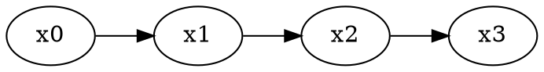

# Avaliar uma aula

Validar diz se a aula cabe no contrato. **Avaliar** diz se ela é uma boa aula: se cada slide tem uma ideia, se o título afirma alguma coisa, se há texto demais e figura de menos. As duas perguntas são diferentes, e as respostas também: o validador dá **erro** e **aviso**; a avaliação dá só **alerta** e **conselho**, e nunca impede nada — nem a projeção, nem o PDF, nem o `aula-usp build`.

A avaliação é para aula que **já valida sem erros**. Numa aula com erro, conserte primeiro; um slide que estoura o contrato não precisa de conselho sobre estilo.

## De onde vêm os critérios

Duas fontes, citadas pelo identificador em cada achado:

- **N**, de Naegle, "Ten simple rules for effective presentation slides" (*PLOS Computational Biology*, 2021). As dez regras são N1 a N10: uma ideia por slide (N1), o tempo como orçamento (N2), título que afirma a conclusão (N3), só o essencial no slide (N4), crédito para o que é de outros (N5), figura no lugar de texto (N6), poucos elementos de uma vez (N7), a mensagem que chega a quem se distraiu (N8), o fio entre um slide e o seguinte (N9).
- **U**, das recomendações de desenho de apresentações da UC San Diego, apoiadas na pesquisa de Mayer sobre aprendizagem multimídia: listas curtas, reveladas item a item, e imagem sem enfeite nem texto que a repita.

N é a espinha, e U refina. Onde as duas discordam — U pede no máximo quatro itens numa lista; N aceita um pouco mais —, o critério de N decide o **alerta**, e o de U, mais estrito, só dá **conselho**.

## Como avaliar

Com a linha de comando instalada:

```bash
aula-usp avaliar minha-aula
aula-usp avaliar minha-aula --minutos 50
aula-usp avaliar minha-aula --slide resultados
```

Cada achado sai numa linha, no desenho das linhas do validador: o nível, o slide, o critério com a fonte, o que foi medido e o que fazer. No fim, um resumo por critério. A saída é sempre 0, com ou sem alertas: avaliar não é validar.

`--minutos` diz a duração da aula e liga o critério de tempo. `--slide` avalia um slide só, pelo id ou pela posição, e deixa de fora os critérios que olham a aula inteira. `--json` dá os achados como objetos, para um agente consumir, e `--fotos <pasta>` grava uma imagem de cada slide, com os passos todos revelados, para quem vai julgar o que não se mede.

**Sem a linha de comando**, os critérios medidos se medem à mão, com as definições da tabela abaixo: conte as palavras, os itens, os blocos e as figuras de cada slide, e compare com o número da tabela.

## O que se mede

Estes a linha de comando calcula sozinha. As palavras são as que a plateia lê no corpo do slide: título, notas do apresentador, matemática, código e os dados de gráficos e diagramas ficam de fora.

<!-- gerado:tabela-da-rubrica-medidos -->
| critério | fonte | alcance | nível máximo | acusa quando | o que fazer |
|---|---|---|---|---|---|
| `titulo-rotulo` | N3 | slide | alerta | título de conteudo, figura, afirmacao com até 2 palavras, ou igual a um rótulo genérico ("introdução", "motivação", "resultados", "métodos", "metodologia", "discussão", "conclusão", "conclusões", "background", "contexto", "resumo", "exemplo", "exemplos"), sem contar caixa nem pontuação | Troque o rótulo por uma frase que diga a conclusão do slide: não "Resultados", mas o que os resultados mostram. |
| `elementos` | N7 | slide | alerta | mais de 6 blocos de corpo no slide, contados dentro das colunas; título, lide e notas não contam | Tire do slide o que não for essencial ou divida-o em dois: acima de uns seis elementos a plateia deixa de acompanhar. |
| `itens` | U | slide | conselho | lista com mais de 4 itens | Deixe a lista em até quatro itens: junte os parecidos, passe o resto para a fala ou para outro slide. |
| `revelacao` | U | slide | conselho | lista com mais de 3 itens e nenhum `data-passo` | Revele a lista item a item, com passos, para a plateia ler o que você está dizendo e não o que vem depois. |
| `so-texto` | N6, U | aula | alerta | mais de 50% dos slides de conteudo, figura, demo sem figura, gráfico, diagrama, demo, código nem fórmula em destaque; a matemática em linha não conta | Troque parte do texto por figura, gráfico, diagrama, fórmula ou código: mais da metade dos slides de conteúdo só tem texto. |
| `paineis` | N6 | slide | conselho | mais de 1 figura no mesmo slide | Mostre uma figura por vez: divida o slide, e cada figura ganha o seu título e a sua fala. |
| `credito` | N5 | slide | conselho | figura com imagem, SVG ou gráfico sem `p.fonte` no slide nem legenda com "Fonte", "Adaptado de", "Dados de", "Crédito" ou um ano entre parênteses; diagramas e demos não contam | Diga de onde vem a figura ou os dados, numa linha de fonte ou na legenda; se for sua, a legenda pode dizer isso. |
| `tempo` | N2 | aula | alerta | só com a duração da aula: mais de 1,2 × N slides para N minutos, a 1 minuto por slide, contando todos menos capa, abertura, encerramento | Corte slides ou peça mais tempo: a conta é de cerca de um minuto por slide de conteúdo. |
| `palavras-slide` | N4, N7 | slide | conselho | mais de 60 palavras no slide, sem contar título, notas, matemática, código e os dados de gráfico e diagrama | Enxugue o texto: o que é explicação vai para a fala ou para as notas, e no slide fica o que a plateia precisa ver. |
<!-- /gerado -->

## O que se julga

Estes não têm número: quem avalia olha o slide e responde à pergunta, com `ok`, `conselho` ou `alerta`, uma evidência de uma frase apontando o elemento, e uma sugestão que se possa fazer.

<!-- gerado:tabela-da-rubrica-julgados -->
| critério | fonte | alcance | nível máximo | a pergunta |
|---|---|---|---|---|
| `uma-ideia` | N1 | slide | alerta | O slide entrega uma só ideia? |
| `titulo-conclusao` | N3 | slide | alerta | O título afirma a conclusão que o corpo do slide sustenta? |
| `essencial` | N4 | slide | alerta | Tudo o que está no slide vai ser comentado, ou há algo que ficaria sem ser dito? |
| `grafico-eficaz` | N6 | slide | alerta | O gráfico ou a figura leva a mensagem do slide sozinho, legível de longe? |
| `distraido` | N8 | slide | alerta | Quem não ouviu nada leva a mensagem só pelo título e pela figura? |
| `redundancia` | U | slide | conselho | O texto evita repetir por extenso o que a imagem já diz? |
| `decorativa` | U | slide | conselho | Toda imagem do slide tem função, sem nenhuma só de enfeite? |
| `fluxo` | N9 | aula | alerta | A passagem de cada slide para o seguinte faz sentido para quem assiste? |
<!-- /gerado -->

## Como ler um alerta

Um alerta é um convite a olhar o slide de novo, não uma ordem. Três cuidados:

- **Não corte conteúdo para calar a métrica.** Uma derivação passo a passo pode ter mais palavras que o conselho e continuar certa; o que o critério pergunta é se cada palavra precisa estar na tela, ou se parte dela é fala.
- **Os critérios medidos não enxergam o sentido.** Um título de três palavras pode ser só um rótulo mais comprido, e a lista de rótulos genéricos não é exaustiva: por isso existe o critério julgado `titulo-conclusao`, ao lado do medido.
- **`so-texto` conta só os slides de conteúdo.** Uma aula que põe as figuras em slides de figura, e o texto nos de conteúdo, pode receber o alerta tendo imagem de sobra — e a matemática em linha também não conta como figura. Leia o alerta com a aula inteira na cabeça.

A avaliação não muda a aula. O que fazer com cada achado é do autor.

## Corrigir um slide

Corrigir é mexer num slide só e deixar o resto do arquivo como estava, byte a byte: sem reformatar, sem trocar aspas, sem tocar no `<head>` nem nos outros slides. O pedido vem do autor ("o título está longo"), de uma sugestão da avaliação que ele aceitou, ou de um achado do validador naquele slide.

Com a linha de comando instalada, são três comandos:

```bash
aula-usp slide minha-aula variancia                     # imprime o fonte do slide, byte a byte
aula-usp slide minha-aula variancia --substituir novo.html
aula-usp validar minha-aula --slide variancia           # valida a aula, relata só este slide
```

O slide se diz pelo `id` da `section` ou pela posição, de 1 ao último — a mesma numeração das mensagens do validador e da avaliação. Se um id e uma posição coincidirem, vale o id.

`--substituir` troca só aquela `section` pela do arquivo, que tem de ter **uma** `section` e mais nada, com o mesmo `id` da original. O resto da aula fica idêntico, e a gravação é de uma vez: um comando interrompido não deixa meio arquivo. Um id diferente é recusado, porque outro slide pode apontar para ele; se a troca for de propósito, `--forcar`. Para **partir um slide em dois**, o arquivo leva duas `section`s e o comando leva `--dividir`: a primeira fica no lugar da original, e a segunda, com um id novo, entra logo depois. É o único jeito de a correção acrescentar um slide, e ele só se usa com o autor de acordo.

`slide` não valida nada: depois de trocar, rode `validar --slide`. Ele valida a aula inteira — a composição só se mede com a aula toda na tela —, mas relata só o slide pedido, conta numa linha os achados que ficaram de fora, e sai com erro só se o erro for daquele slide. Se o pedido veio de uma avaliação, rode também `aula-usp avaliar minha-aula --slide variancia` e confira que o alerta sumiu. Para ver o slide antes e depois, `--fotos` do `avaliar` grava a imagem dele.

**Sem a linha de comando**, a regra é a mesma, feita à mão: reescreva só a `section` pedida e devolva a aula inteira, com todas as outras `section`s e o `<head>` exatamente como estavam, sem resumir nenhum trecho.

## Gerar a partir de um roteiro e de fontes

Gerar é partir de um **roteiro**: um arquivo em markdown que diz, slide a slide, o layout, o título e o corpo de cada um. O roteiro é esqueleto e rascunho, não um segundo formato completo: o que ele não sabe dizer — demos, exercícios — se escreve depois, no HTML. A vantagem é poder discutir a aula antes de escrevê-la: o roteiro cabe numa tela, e o professor aprova ou corta slides nele, sem ler HTML.

Com a linha de comando instalada:

```bash
aula-usp roteiro roteiro.md minha-aula
aula-usp roteiro roteiro.md minha-aula --substituir
```

O comando escreve `minha-aula/index.html`, com a tag do runtime da versão instalada, copia para `minha-aula/img/` as figuras que o roteiro cita pelo caminho relativo a ele, e roda `aula-usp validar`: a saída é a do validador, e o código também. A conversão é determinística — o mesmo roteiro dá sempre os mesmos bytes, sem modelo de linguagem no meio. Uma pasta que já tem `index.html` é recusada, salvo com `--substituir`, que troca o `index.html` e as figuras e deixa o resto da pasta como está.

Um **erro de roteiro** para tudo antes de escrever: o comando sai com 1 e diz o arquivo e a linha de cada erro — um layout que não existe, uma marcação desconhecida, uma legenda solta, uma figura que não está lá, um bloco que o layout não aceita. Conserte o roteiro e rode de novo.

### Um roteiro inteiro

````markdown
---
unidade: ifusp
disciplina: Física Estatística
aula: 3
data: 2026-10-05
professor: Prof. Renato Vicente
---

# Passeio aleatório | e difusão

## abertura: O passeio {#passeio}
? Onde para quem dá N passos ao acaso?

## conteudo: A variância cresce | linearmente com o tempo {#variancia}
> A variância depois de N passos é \( N a^2 \).
1. Os passos são independentes.
2. + Os termos cruzados somem na média.
[destaque: Definição] Passeio aleatório: soma de passos independentes.
nota: Pedir a um aluno que ande jogando uma moeda.
fonte: Adaptado de Feller, vol. 1, cap. III.

## figura: A nuvem se espalha | como raiz de t {#nuvem}

legenda: Posições finais de dez mil caminhantes, numa simulação nossa.
nota: A largura do histograma é o desvio, que cresce como a raiz de N.

## afirmacao {#dobro}
Com quatro vezes mais passos, a nuvem fica só duas vezes mais larga.
nota: Parar aqui e deixar a turma conferir com a figura anterior.

## abertura: O limite contínuo {#limite curto="Limite"}
? O que acontece quando os passos ficam pequenos?

## conteudo: A difusão é o limite | de passos pequenos {#difusao}
:::colunas 6-6
Com passos de tamanho \( a \) a cada intervalo \( \tau \):
$$ D = \frac{a^2}{2\tau} $$
---
[alerta: Cuidado] O limite pede \( a \to 0 \) e \( \tau \to 0 \) **juntos**.
[quadro: Exemplo] Uma gota de tinta num copo d'água parado.
:::
nota: A razão entre os dois precisa ficar fixa; é o que dá sentido ao *coeficiente*.

## conteudo: A simulação | cabe num laço {#simulacao}
> Cada linha soma um passo de mais ou menos um.
```python
import numpy as np
passos = np.random.choice([-1, 1], size=(10000, 100))
posicoes = passos.sum(axis=1)
print(posicoes.var())
```
nota: Rodar ao vivo com 100 e com 400 passos.

## figura: A variância medida | cresce em linha reta {#medida}
```grafico
{"tipo":"linha","dados":{"passos":[100,200,400],"variancia":[99,203,398]},"x":"passos","y":["variancia"],"eixos":{"x":"passos","y":"variância"}}
```
legenda: Variância das posições finais, na mesma simulação.
nota: A reta é a previsão; os pontos, o que a simulação mediu.

## figura: Cada passo | depende só do anterior {#cadeia}

nota: A cadeia não tem memória: é o que faz os termos cruzados sumirem.

## encerramento: O que fica
- A variância cresce com N.
- A difusão é o limite contínuo.
próxima: equação de Fokker-Planck.
````

### A sintaxe

O **cabeçalho**, entre as duas linhas `---`, traz as metas, uma por linha, como `chave: valor`: `unidade`, `data` e `professor` são obrigatórias, e `disciplina`, `aula` e `video` são opcionais. A linha `# Título | segunda linha` é a capa, uma vez só, antes do primeiro slide; o `|` separa a segunda linha, que sai em azul, e o título da aba do navegador é o que vem antes dele.

Cada slide começa com `## layout: título {#id}`, termina no próximo `##` ou no fim do arquivo, e o `|` do título separa a segunda linha, como na capa. O `{#id}` é opcional: sem ele, o id é tirado do título, e repetidos ganham `-2`, `-3`. A capa e o encerramento ficam sem id. Na abertura, `curto="…"` dá o nome curto do bloco no mapa; sem ele, um título que passe do limite é truncado nesse limite, numa fronteira de palavra. `afirmacao` não tem título: o texto do slide é a frase, e o id sai dela.

Linhas seguidas formam um parágrafo, e uma linha em branco separa um parágrafo do seguinte. No começo da linha, estas marcações:

| marcação | vira |
|---|---|
| `>` | o lide |
| `?` | a pergunta da abertura |
| `- ` | uma lista; no encerramento, a síntese |
| `1. ` | uma lista numerada, com qualquer número; no encerramento, a síntese |
| `+ ` logo depois do marcador do item | o item revelado num clique |
| `[destaque: rótulo]`, `[alerta: rótulo]`, `[quadro: rótulo]` | a caixa, com o texto na mesma linha |
| `nota:` | as notas do apresentador; várias se juntam, no fim do slide |
| `fonte:` | a linha de fonte, logo depois do corpo; numa coluna, no fim da coluna |
| `legenda:` | a legenda da figura, do gráfico ou do diagrama logo acima |
| `próxima:` | a próxima aula, no encerramento, depois de "Próxima aula:" |
| `` | a figura, sozinha na linha, com a descrição no `alt` |

E estes blocos, de várias linhas:

- três crases e a linguagem abrem um bloco de **código**, e três crases o fecham; a linguagem é uma das do contrato (`python`, `r`, `sql`, `javascript`, `bash`, `json`, `latex`);
- `grafico` no lugar da linguagem faz um **gráfico**, com o JSON dele dentro; `dot` faz um **diagrama**;
- `$$ … $$`, numa linha ou em várias, ou `\[ … \]`, é a **fórmula em destaque**;
- `:::colunas 6-6` abre as **colunas**, `---` passa para a coluna seguinte e `:::` fecha; a grade é uma das do contrato, com uma coluna para cada parte.

No texto, `\( … \)` é matemática em linha, `**assim**` é negrito e `*assim*` é itálico. Nenhum outro markdown em linha: um `_sublinhado_` ou um link ficam como estão. O roteiro escapa `&`, `<` e `>` do texto; dentro da matemática, só `<` e `&`.

Três coisas o roteiro não exprime, e ficam para o HTML depois de gerado: a **demo**, que precisa do script dela; o **exercício**, com enunciado e resposta; e o quadro numerado. Um `## demo:` no roteiro é recusado com a linha, para ninguém achar que ele saiu.

### De onde vem o roteiro

A skill `aula-usp-gerar` escreve o roteiro a partir de fontes: artigos em PDF, apresentações em PDF, PPTX ou Beamer, e outras aulas do Aula USP. Ela lê as fontes, escreve o roteiro seguindo a rubrica de avaliação acima — título que afirma, uma ideia por slide, cerca de um minuto por slide, crédito em toda figura e dado alheio —, **mostra o roteiro ao professor e espera o "sim"** antes de gerar o HTML. Depois roda `aula-usp roteiro`, completa o que o roteiro não exprime, valida até zero erros, avalia, e aplica as correções que o professor aceitar.

Figura tirada de um artigo entra só com crédito, na `fonte:` ou na legenda, e com a licença do artigo em mente: quando ela não for aberta, o professor precisa saber antes de projetar.

**Sem a linha de comando**, o roteiro continua servindo de plano: o agente mostra o roteiro, espera o "sim", e escreve o HTML direto, slide a slide, seguindo o roteiro e a tabela acima — cada marcação vira o elemento que ela diz.
